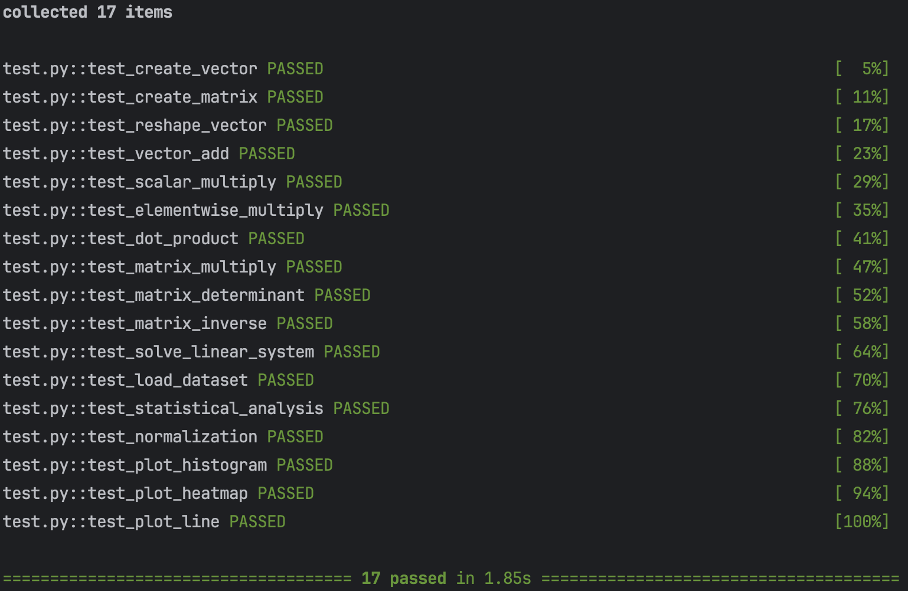
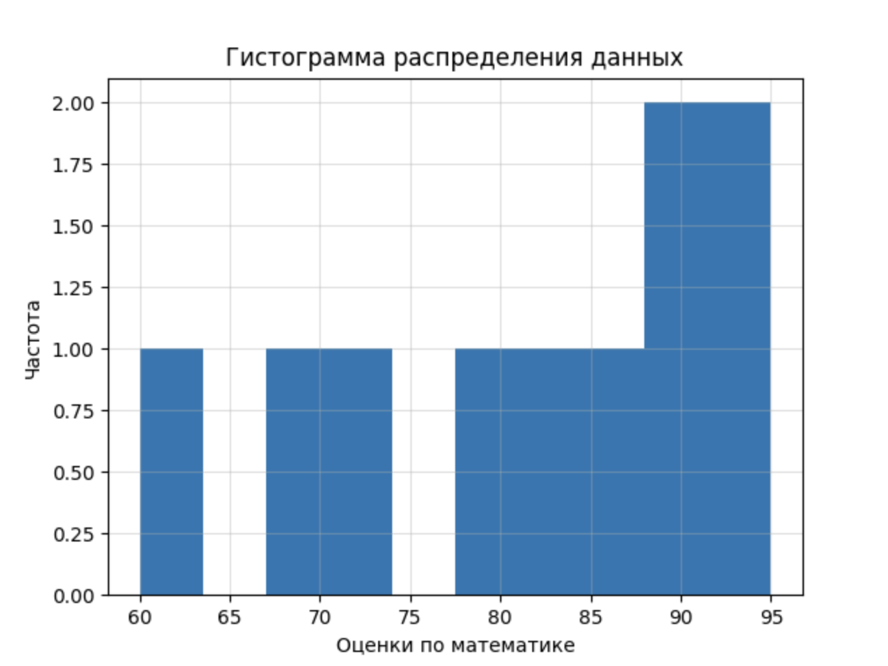
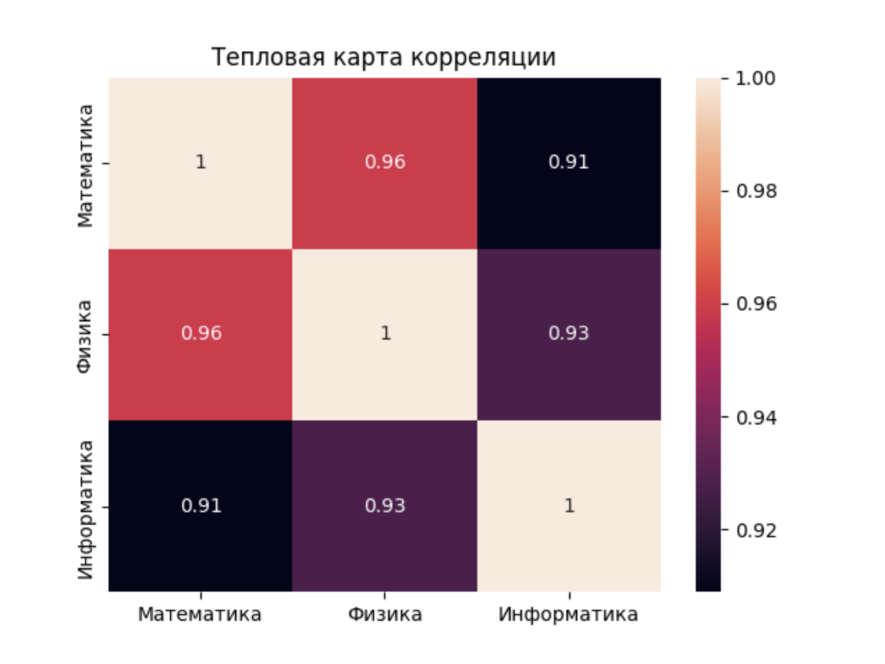

**Задание 1: Создание и обработка массивов**

```python
def create_vector() -> np.ndarray:
    """
    Создает массив типа numpy.ndarray целых чисел в промежутке [0, 10)
    """
    return np.arange(10)

def create_matrix() -> np.ndarray:
    """
    Создает матрицу 5x5 со случайными числами, заполненную выборками из распределения U[0, 1)
    """
    return np.random.rand(5, 5)

def reshape_vector(vec: np.ndarray) -> np.ndarray:
    """
    Преобразует размерность массива в формате (10,) -> (2, 5)
    """
    return vec.reshape(2, 5)

def transpose_matrix(mat: np.ndarray) -> np.ndarray:
    """
    Транспонирует матрицу
    """
    return mat.T
```

**Задание 2: Векторные операции**

```python
def vector_add(a: np.ndarray, b: np.ndarray) -> np.ndarray:
    """
    Выполняет поэлементное сложение
    """
    return a + b

def scalar_multiply(vec: np.ndarray, scalar: int | float) -> np.ndarray:
    """
    Выполняет умножение вектора на скаляр
    """
    return vec * scalar

def elementwise_multiply(a: np.ndarray, b: np.ndarray) -> np.ndarray:
    """
    Выполняет произведение Адамара
    """
    return a * b

def dot_product(a: np.ndarray, b: np.ndarray) -> float:
    """
    Вычисляет скалярное произведение
    """
    return a.dot(b)
```

**Задание 3: Матричные операции**

```python
def matrix_multiply(a: np.ndarray, b: np.ndarray) -> np.ndarray:
    """
    Выполняет умножение матриц
    """
    return a @ b

def matrix_determinant(a: np.ndarray) -> float:
    """
    Вычисляет определитель матрицы
    """
    return np.linalg.det(a)

def matrix_inverse(a: np.ndarray) -> np.ndarray:
    """
    Вычисляет обратную матрицу
    """
    return np.linalg.inv(a)

def solve_linear_system(A: np.ndarray, b: np.ndarray) -> np.ndarray:
    """
    Решает систему Ax = b
    """
    return np.linalg.solve(A, b)
```

**Задание 4: Статистический анализ**

```python
def load_dataset(path="data/students_scores.csv") -> np.ndarray:
    """
    Загружает данные из .csv файла в массив
    """
    return pd.read_csv(path).to_numpy()

def statistical_analysis(data: np.ndarray) -> dict:
    """
    Для данных вычисляет:
    - среднее значение
    - медиану
    - стандартное отклонение
    - минимум
    - максимум
    - 25 и 75 перцентили
    """
    return {'mean': np.mean(data), 'median': np.median(data), 'std': np.std(data),
            'min': np.min(data), 'max': np.max(data),
            'first quartile': np.percentile(data, 25), 'third quartile': np.percentile(data, 75)}

def normalize_data(data: np.ndarray) -> np.ndarray:
    """
    Выполняет min-max нормализацию массива
    """
    d_min, d_max = data.min(), data.max()
    return (data - d_min) / (d_max - d_min)
```

**Задание 5: Визуализация**

```python
def plot_histogram(data: np.ndarray, xlabel='Значения', ylabel='Частота') -> None:
    """
    Строит гистограмму распределения данных
    Результат сохраняется в папку plots
    """
    os.makedirs('plots', exist_ok=True)
    plt.hist(data, bins=10)
    plt.grid(alpha=0.4)
    plt.title('Гистограмма распределения данных')
    plt.xlabel(xlabel)
    plt.ylabel(ylabel)
    plt.savefig('plots/histogram.png')
    plt.close()

def plot_heatmap(matrix: np.ndarray, xticklabels=None, yticklabels=None) -> None:
    """
    Строит тепловую карту корреляции
    Результат сохраняется в папку plots
    """
    os.makedirs('plots', exist_ok=True)
    sns.heatmap(
        matrix,
        annot=True,
        xticklabels=xticklabels or range(len(matrix)),
        yticklabels=yticklabels or range(len(matrix[0]))
    )
    plt.title('Тепловая карта корреляции')
    plt.savefig('plots/heatmap.png')
    plt.close()

def plot_line(x: np.ndarray, y: np.ndarray, xlabel='Признак', ylabel='Таргет') -> None:
    """
    Строит график зависимости таргета от признака
    Результат сохраняется в папку plots
    """
    os.makedirs('plots', exist_ok=True)
    plt.plot(x, y, marker='o')
    plt.grid(alpha=0.4)
    plt.title('График зависимости')
    plt.xlabel(xlabel)
    plt.ylabel(ylabel)
    plt.savefig('plots/line_plot.png')
    plt.close()
```

**Тестирование**

Тесты

```python
from main import *

def test_create_vector():
    v = create_vector()
    assert isinstance(v, np.ndarray)
    assert v.shape == (10,)
    assert np.array_equal(v, np.arange(10))

def test_create_matrix():
    m = create_matrix()
    assert isinstance(m, np.ndarray)
    assert m.shape == (5, 5)
    assert np.all((m >= 0) & (m < 1))

def test_reshape_vector():
    v = np.arange(10)
    reshaped = reshape_vector(v)
    assert reshaped.shape == (2, 5)
    assert reshaped[0, 0] == 0
    assert reshaped[1, 4] == 9

def test_vector_add():
    assert np.array_equal(
        vector_add(np.array([1, 2, 3]), np.array([4, 5, 6])),
        np.array([5, 7, 9])
    )
    assert np.array_equal(
        vector_add(np.array([0, 1]), np.array([1, 1])),
        np.array([1, 2])
    )

def test_scalar_multiply():
    assert np.array_equal(
        scalar_multiply(np.array([1, 2, 3]), 2),
        np.array([2, 4, 6])
    )

def test_elementwise_multiply():
    assert np.array_equal(
        elementwise_multiply(np.array([1, 2, 3]), np.array([4, 5, 6])),
        np.array([4, 10, 18])
    )

def test_dot_product():
    assert dot_product(np.array([1, 2, 3]), np.array([4, 5, 6])) == 32
    assert dot_product(np.array([2, 0]), np.array([3, 5])) == 6

def test_matrix_multiply():
    A = np.array([[1, 2], [3, 4]])
    B = np.array([[2, 0], [1, 2]])
    assert np.array_equal(matrix_multiply(A, B), A @ B)

def test_matrix_determinant():
    A = np.array([[1, 2], [3, 4]])
    assert round(matrix_determinant(A), 5) == -2.0

def test_matrix_inverse():
    A = np.array([[1, 2], [3, 4]])
    invA = matrix_inverse(A)
    assert np.allclose(A @ invA, np.eye(2))

def test_solve_linear_system():
    A = np.array([[2, 1], [1, 3]])
    b = np.array([1, 2])
    x = solve_linear_system(A, b)
    assert np.allclose(A @ x, b)

def test_load_dataset():
    test_data = "math,physics,informatics\n78,81,90\n85,89,88"
    with open("test_data.csv", "w") as f:
        f.write(test_data)
    try:
        data = load_dataset("test_data.csv")
        assert data.shape == (2, 3)
        assert np.array_equal(data[0], [78, 81, 90])
    finally:
        os.remove("test_data.csv")

def test_statistical_analysis():
    data = np.array([10, 20, 30])
    result = statistical_analysis(data)
    assert result["mean"] == 20
    assert result["min"] == 10
    assert result["max"] == 30

def test_normalization():
    data = np.array([0, 5, 10])
    norm = normalize_data(data)
    assert np.allclose(norm, np.array([0, 0.5, 1]))

def test_plot_histogram():
    data = np.array([1, 2, 3, 4, 5])
    plot_histogram(data)

def test_plot_heatmap():
    matrix = np.array([[1, 0.5], [0.5, 1]])
    plot_heatmap(matrix)

def test_plot_line():
    x = np.array([1, 2, 3])
    y = np.array([4, 5, 6])
    plot_line(x, y)
```

Результат



**Визуализация на примере датасета**

Датасет

```csv
math,physics,informatics
78,81,90
85,89,88
92,94,95
70,75,72
88,84,91
95,99,98
60,65,70
73,70,68
84,86,85
90,93,92
```

Код

```python
df = pd.read_csv('data/students_scores.csv')

students = np.arange(1, len(df) + 1)
math_scores = df['math'].values
scores_corr_matrix = df.corr().values

plot_histogram(math_scores, xlabel='Оценки по математике')
plot_heatmap(
    scores_corr_matrix,
    xticklabels=['Математика', 'Физика', 'Информатика'],
    yticklabels=['Математика', 'Физика', 'Информатика']
)
plot_line(students, math_scores, xlabel='Номер студента', ylabel='Оценка по математике')
```

Результат (histogram)



Результат (heatmap)



Результат (line plot)


